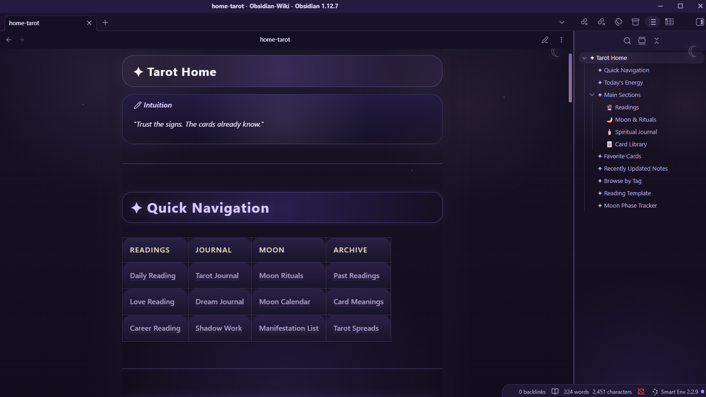

# Tarot Pro Lite

A soft feminine tarot-inspired Obsidian theme with lavender glow, moonlight gradients and mystical cards.

## Installation

1. Download the latest release
2. Put the folder into:

.obsidian/themes/TarotProLite/
3. Enable the theme in Obsidian Appearance settings.
